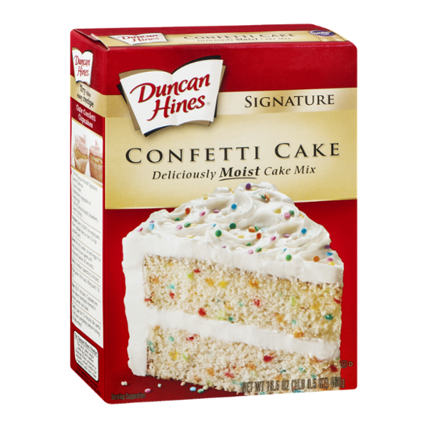

## We're Lazy

Each semester I enroll in a couple different ICS classes, yet I seem to hear the same four words coming out of their mouths - "Computer Scientists are lazy." Typically, what they follow up with those words are an encouragement to look for a simpler way to solve a problem. No one wants to write hundreds of lines of code trying to solve a problem that in actuality would only need a fraction of that. For just about anything in the computer science realm, there is always a shortcut to solving a problem or completing a task. In software engineering, this shortcut is called Design Patterns.

## Boxed Caked Is Just as Tasty

When it comes to baking, it's widely accepted that a baked good made from scratch is the only way to go if you want the tastiest, most mouth-watering treat. However, not everyone has the time, energy, skill, or knowledge to know how to bake everything to perfection. Thus, boxed baked goods were born. Muffins, cupcakes, cakes, brownies, cookies - you name it, it's in a box in your nearest grocery store. It's the most convenient and simplistic way for anyone to be able to bake something. If you wanted to, there even ways you could spice up your boxed baked good like <a href="https://www.allthingsmamma.com/10-tricks-to-make-a-box-cake-mix-taste-homemade/">this</a> article explains you can do with boxed cake.

## The Triad of Design Patterns

Design Patterns can be split into three subsections: Creational, Structural, and Behavioral. 

<b>Creational Patterns</b> are used when you want to create objects that you can just call upon the code necessary instead of having to instantiate the objects yourself. In the cake analogy, this can already be seen as boxed cake where you already have most of the necessary ingredients to create the cake and you only need to do a few things to actually make it.

<b>Structural Patterns</b> primarily focus on what makes up the Classes and Objects being used. For this, you can think of as the modifications to the regular old boxed cake to tailor it to your own taste.

<b>Behavioral Patterns</b> are comprised of how objects/classes communicate. This can translate to the instructions for making cake, whether is be from scratch or boxed. The finished product may be the same but the instructions are quite different depending on the type of cake being made.

Just because something comes pre-made or partially finished, doesn't mean you're cheating yourself of quality. Design Patterns are a lot like boxed cake. Yes, someone already did some of the work for you but if you wanted, you could add your own twist on it and make it yours. You don't always have to start from scratch to get a great finished product tailored to solving the problem at hand.
