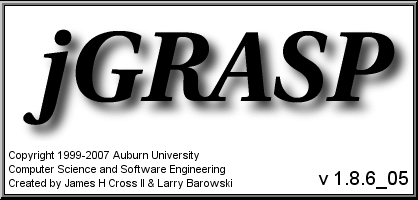
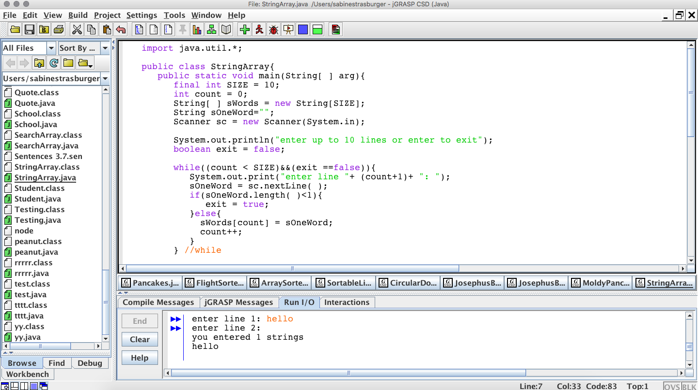
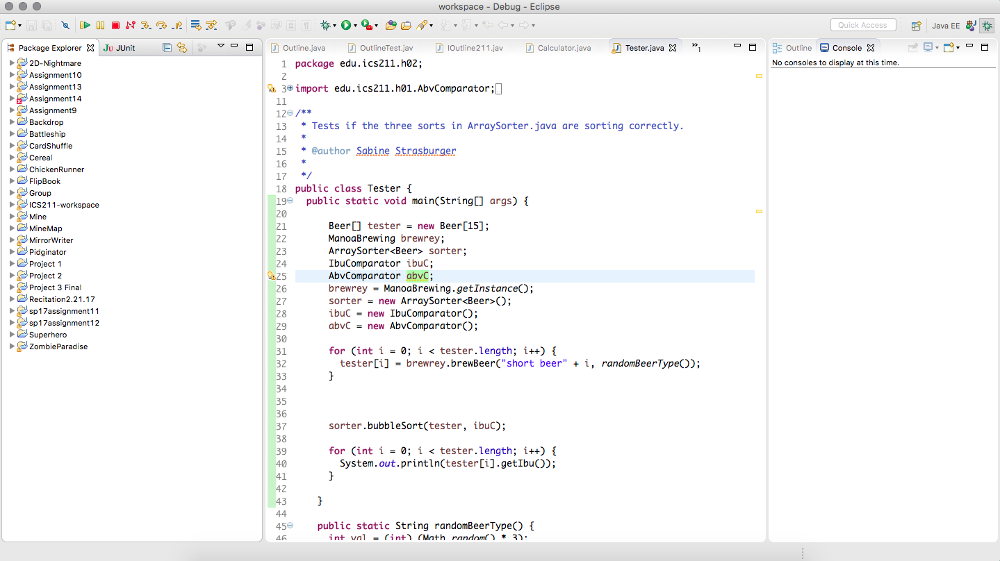

I never knew about the struggles of coding until my first few assignments, then project in ICS 111. Being a complete beginner at writing code and not knowing anything about Java, I felt I was at risk for falling behind in the class because there was no way I was going to memeorize all the syntax of the language in a semester's time.

## Can't Grasp jGRASP

I had initially taken ICS 111 at Kapi'olani Community College to test the waters on Computer Science. In retrospect, that was a good move on my part because that class was more slow-paced and geared towards students who had little to no experience in coding. The only complaint I had was the development environment my professor required - jGRASP. jGRASP is described as a "lightweight development environment created specifically to provide automatic generation of software visualizations to improve the comprehensibility of software." At the time, jGRASP seemed so advanced and hard to work with, but having more experience with other, better development environments, I can see how primitive jGRASP really is. It had an early 2000s Windows feel about it and didn't have any sort of editor that would show an error in the code as you were typing. The only way you would know if there was something amok in your code is when you run it and the console would display that there was an error. It was very infuriating and made assignments take a lot longer to do than it should have taken.

I barely got by in that class and I wholeheartedly believe it was because of jGRASP. Maybe my professor thought that using the most basic environment would somehow be an advantage for us in the long run. But for newbies to coding, it was a massive disadvantage as I was less inclined to want to attempt my homework knowing the amount of hours I'd potentially have to put in trying to debug my errors instead of actually solving the homework problem.

## Second Time's the Charm

When I transferred to Manoa and registered for ICS 111 again, I felt that if I got through a whole semester using jGRASP for the first time and barely got by, I could do it again and ace the class. Then we were introduced to Eclipse and I was discouraged because I would have to start from square one with a new development environment and I'd fall behind again. Or so I thought. To my delight, Eclipse was much more user friendly and was even visually appealing. The greatest benefit of Eclipse that I caught onto right away was that if I had a syntax error, a red mark would appear on the line of code where the error occured. Better yet, Eclipse would give me a hint as to what the syntax error was, saving me a huge amount of time and spared me from the dark times of guessing what I did wrong when I was only limited to jGRASP.

## Double Checking

In ICS 211, we were still required to use Eclipse, but my professor took it a step further and and graded our assignments using the <a href="http://courses.ics.hawaii.edu/ics211f17/morea/010.introduction/reading-java-coding-standard.html">ICS Java Coding Standard</a>. Specifically, he had us install an <a href="http://courses.ics.hawaii.edu/ics211f17/morea/050.software-engineering/ics-se-format.xml">ICS-SE Java formatter</a> as well as the <a href="http://courses.ics.hawaii.edu/ics211f17/morea/050.software-engineering/ics-checkstyle.xml">ICS Checkstyle Ruleset</a>. The formatter correctly indented the code that I wrote to conform with the coding standards of the class. Beyond being a requirement, it was a helpful tool that saved time spent wondering if I'd be marked down for incorrectly indenting a line or not. 

Even more useful was Checkstyle. While at first it was annoying how particular Checkstyle could be, it taught me the importance of uniformity and labeling in code. Checkstyle not only told me where there were syntax errors, but gave me helpful pointers in optimizing my code. For example, if there was a local variable declared but not in use, a yellow marker would appear on that line notifying me of that issue. Checkstyle would even require me to comment on the class I created as well as each of the main methods within the class. This seems like a time-consuming and inconvenient thing to do each time you write a method, but if you think about how many times you'd later go back to that piece of code as a reference, already having a description of what it does written down saves time in the long run versus trying to decipher it again.

## Moving on to Bigger and Better Things

From the first moment I opened up IntelliJ, I could tell I was going to enjoy working with it. If I said Eclipse was easy to use and appealing to the eye, then IntelliJ makes Eclipse look like jGRASP. So far I'm absolutely loving the outward appearance of simplicity IntelliJ gives off, yet having so many tricks up it's sleeve. This is the first time I've dealt with any sort of HTML format and being able to create something that can be opened up in a browser, so I'm very excited to see where this class is going to lead me with that.

Similarly, if I said Checkstyle was useful, then ESLint makes me feel like staying within the class's coding standards is effortless. If we get to use IntelliJ and ESLint for most of the remaining semester, then I'll be quite happy as already it's been useful in my learning of the sytax of JavaScript.

I can definetly say that since I've started using stricter coding standards, I've had a better understanding of what my code does and how to better approach an error when it occurs. Before this class, all I knew was Java so I hadn't seen how much of an impact coding standards has made on learning coding languages in general, but with Java I definetly noticed I retained more information after I had started using Checkstyle. Since the beginning of the semester I've been struggling learning Javascript and Underscore. After this past week of getting used to IntelliJ and ESLint, I was able to complete my first WOD in an adequate amount of time. IntelliJ and ESLint in a way has given me back my confidence to just focus on my coding leave the small problems to them.
