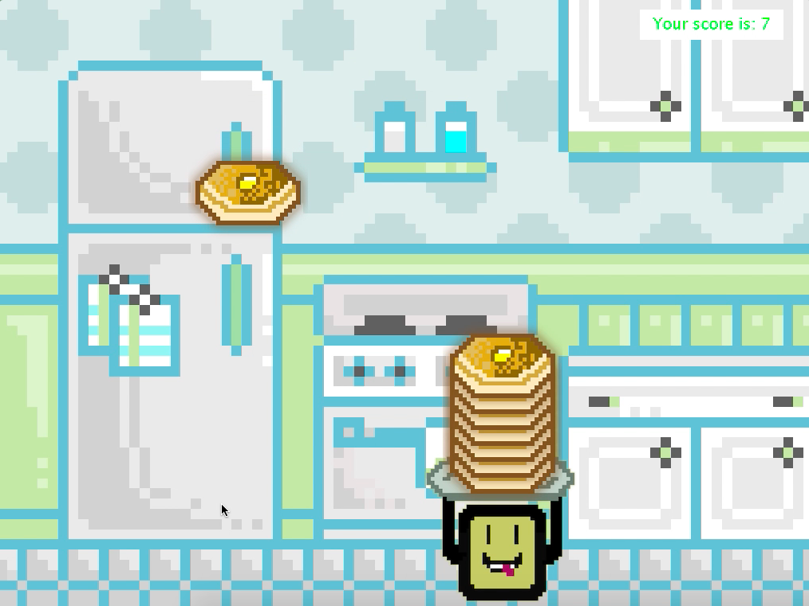
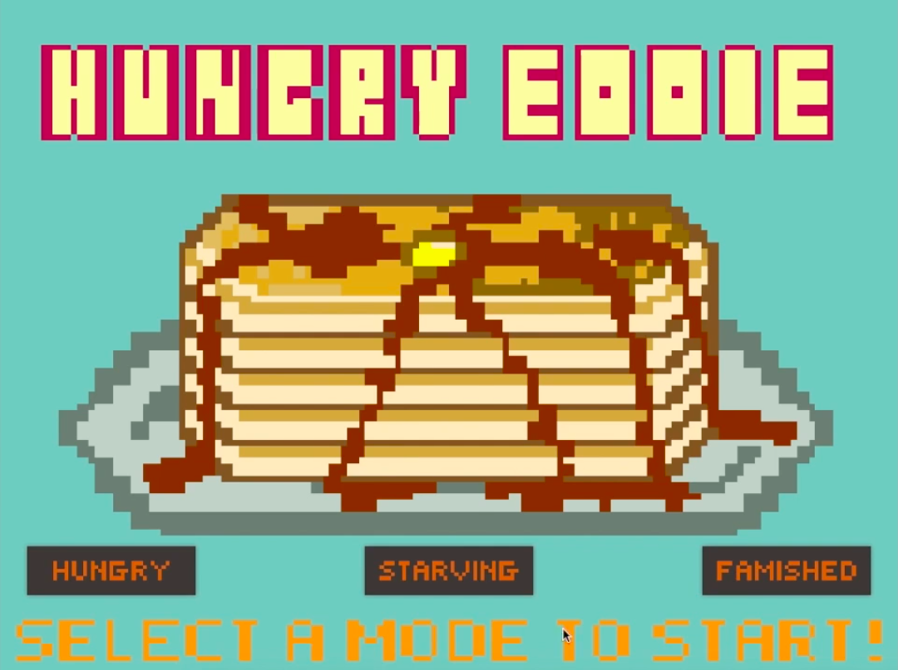

Hungry Eddie is a game me and a few of my classmates from ICS 111 designed for our final project using the different concepts we learned using Java throughout the semester. We were given a list of requirements that needed to be met in our project, but otherwise was given free range to create whatever we wanted. We decided to create a pancake stacking game that the user would be able to control the character as pancakes fell from the top of the screen. It sounds like a simple enough program, but we added factors to the game that made the implementation a little more complicated than first thought.



The game was designed in Eclipse using Java. Once you start the program, a window pops up on the screen and the user is greeted with the start screen of the page and prompted to select a 'mode' to begin. These modes were named "Hungry", "Starving", and "Famished" which represents the speed at which the pancakes fall from the top of the screen. Once the user selects a mode, they're taken to the game play screen and pancakes immediately start falling. The user can then use the 'left' and 'right' arrow keys to move the player left and right so that Eddie can stack some pancakes on his plate! Once 25 pancakes are stacked (the score is displayed at the top right of the screen), the game is won. However, if the stack of pancakes touches a "moldy pancake", the whole stack is lost and the player needs to start all over again, as well as receive a red 'x' at the top right corner of the screen. A red 'x' is also given when a good pancake reaches the bottom of the screen. If a heart is caught, then that will take away one red 'x'.



For this project, I was in charge of creating the graphics of the game. I used photoshop to draw out the background, start scree, pancakes, red heart, and the main character. I used a grid to create the pixelated effects for the graphics. I also created the classes that determined the movement of the character and pancakes, and implemented the use of the start start screen with different modes.

Here is some code from the game that we used to control the movement of the red hearts:

```js
			// HEARTS
			for (int i = 0; i < Heart.size(); i++) {
				// MOVEMENT OF HEARTS
				if (Heart.get(i).Heart.getYCenter() < MAX_SCREEN_Y + 150) {
					Heart.get(i).moveDown();
				}
				// USE BOUNDARIES FUNCTION IN Heart.java FOR Heart
				Heart.get(i).HeartBoundaries(MAX_SCREEN_X);
			}
```

You can see a samle of the game play [here](https://www.youtube.com/watch?v=Kk029e7Ucdc).


