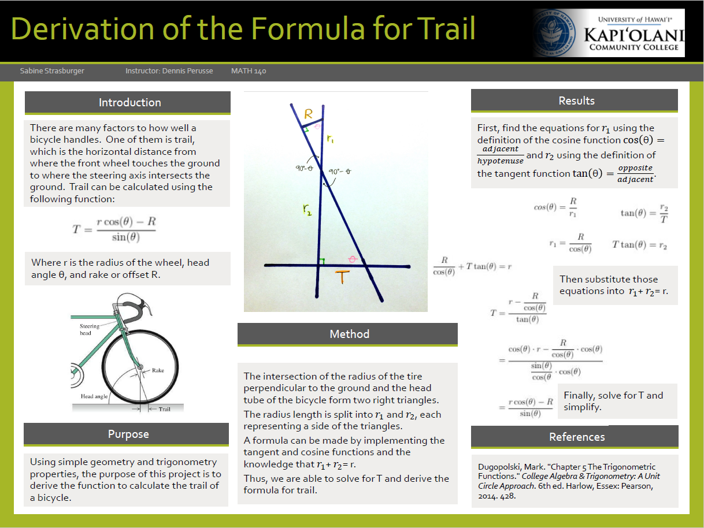

During my last semester at Kapi'olani Community College, I took Math 140 which was Trignometry and Analytic Geometry. I had an excellent professor who didn't teach math in a typical manner. At the end of the semester, he assigned a final project where we were to use what we learned about trigonometry and apply it to a "real world" problem.

I chose to show how you would get the formula for trail, which is the area where the front wheel of a bike touches the ground to where (if you'd draw a straight line down from) the steering access to the ground. Calculating trail is a important factor in understanding the handling capabilities of a bike. This formula can be used for either bicycles or motorcycles. You can read more about trail [Meteor](http://meteor.com)

For this project, I created a poster board (pictured above) displaying how I derived the formula for trail from the definition of trigonomtery functions cosine and tangent. 

Vacay is a web application that I helped create as a team project in ICS 415, Spring 2015. The project helped me learn how to design and implement a responsive web site.

Vacay is implemented using [Meteor](http://meteor.com), a JavaScript application platform. Within two weeks, we created a website that implements several types of reservations including flights, hotels, and car rentals.

In this project I gained experience with full-stack web application design and associated technologies, including [MongoDB](http://mongodb.com) for database storage, the [Twitter Bootstrap](http://getbootstrap.com/) CSS Framework for the user interface, and Javascript for both client and server-side programming. 
 
Source: <a href="https://github.com/theVacay/vacay"><i class="large github icon"></i>theVacay/vacay</a>
